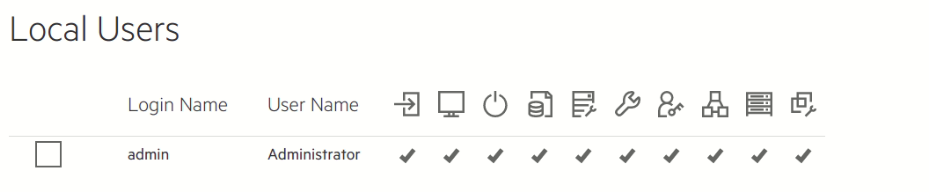

python-ilorest-library
======================

Description
----------
| The python-ilorest-library is a python library built remoting iLO 5.
| Automatically connecting the iLO server by login with the redfish client.
| After connection it will alter and Automatically update the Bios Attributes as they defined in the script.
| Then it will delete the iLO Logical Drives, and creates a new logical drive.
| The Raid definition will be as follows:
| If the Logical Drive has 2 Physical Disks, the raid will be Raid1.
| more than 2 Disks, the first two disks will be Raid1, rest of disks will be Raid10.
| It's mounting virtual media for HPE iLO systems, the Virtual Drive feature supports the use of a CD.
| (you can change the MEDIA_TYPE for a physical floppy disk, DVD-ROM or USBStick. as a default the CD is defined as a MEDIA_TYPE.)
| The ISO file is much faster than reading from physical media. so for using it we mount it as an ISO file on VM with a Dockerfile.
| Upon running the script begins a reboot the iLO server for updating automatically.

pre-req
-------

:code:`pip install redfish`

Permissions
-----
| we need full permission to successfully run the script

running
-------

the main script for running is: **radcom.py**

| Running webserver to create a container from the image:
:code:`$ docker run -d -p 80:80  -v <local_image_path>:/usr/local/apache2/htdocs httpd`  

| <local_image_path> : is the image folder location in the local OS.  

|  
| **to run the script use:**
:code:`$ python radcom.py -m http://<IP_Address>/CentOS-7-x86_64-Minimal-2009-KS-UEFI-GR.iso`

| **Default connection with iLO server:**
" febm-probe.ilo.ps.radcom.co.il "

| **to run it with anther server do:**
:code:`$ python radcom/radcom.py -i <new_URI> -u <new_USER> -p <new_PASS> -m <media_URL>`

| **for example to run with iLO server number 3 use:**
:code:`$ python radcom.py -i febm-prrootobe3.ilo.ps.radcom.co.il -u admin -p Radmin1234 -m 172.29.169.106/CentOS-7-x86_64-Minimal-2009-KS-UEFI-GR.iso`

flags
-----
::

'-i'  - ilo address, absorption of the iLO address to connect the server. 
'-u'  - user name, receiving the iLO user name to connect the server. 
'-p'  - password, receiving the password to verify the connection to the server. 
'-m'  - media url, for media reception through a virtual server.  
'-o'  - os, for installing OS only
'-d'  - logical drives, to get logical drives only

